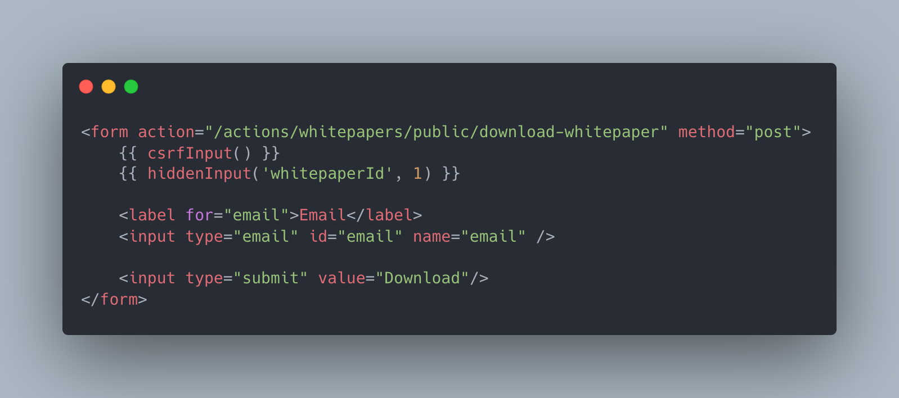
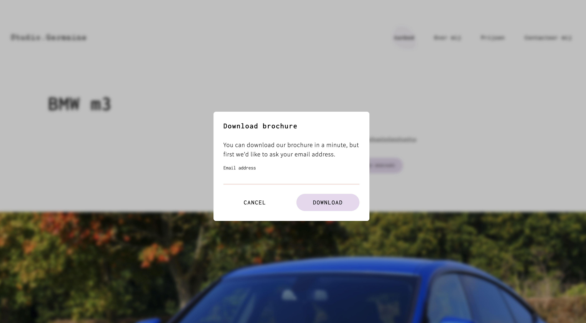
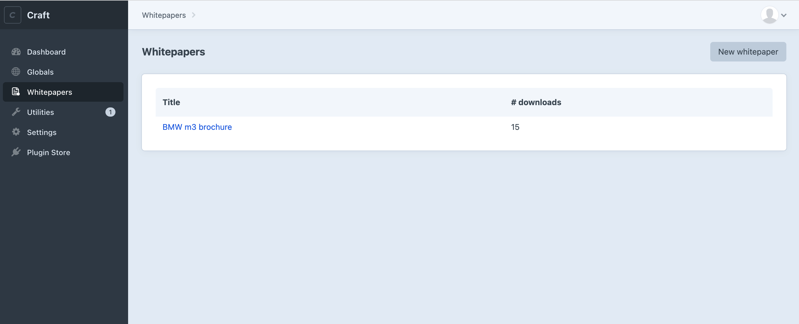
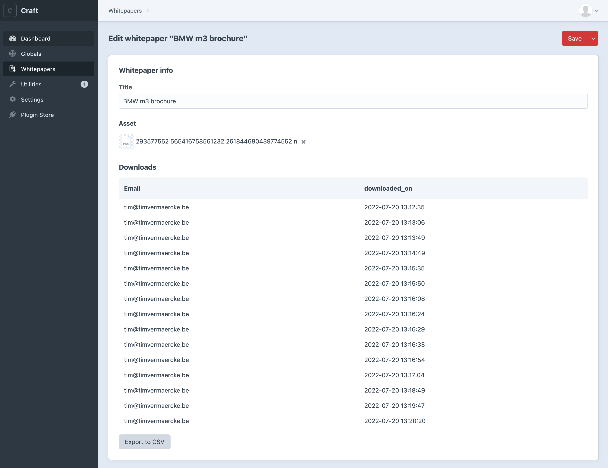
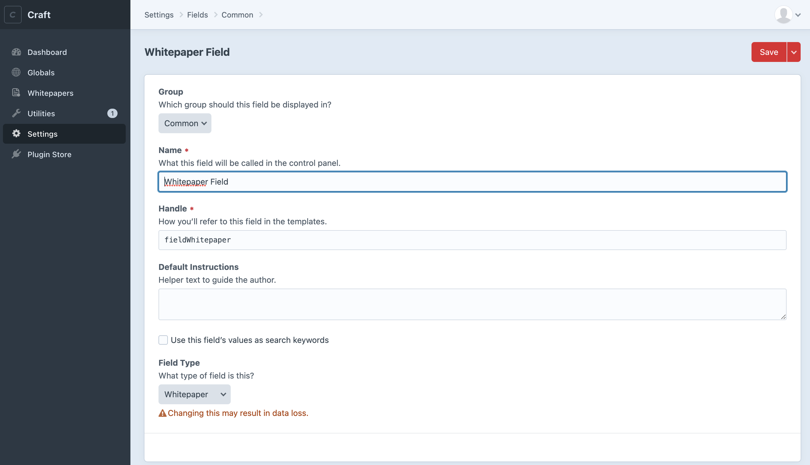
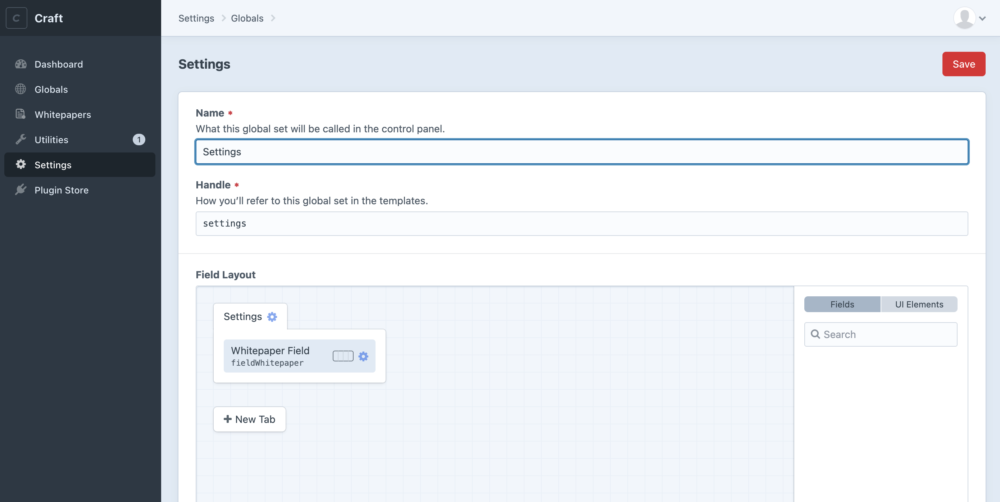
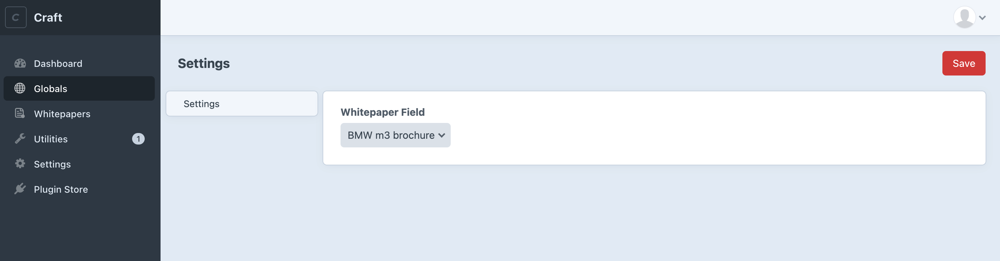

# Whitepaper plugin for Craft CMS 4.x

Let your users download whitepapers (or other files), but not before leaving their email address.

The plugin also provides a Field Type, to link a whitepaper to an entry and it provides CSV exports per whitepaper as well!

## Screenshots

### Frontend (example implementation)




*The above is an example of an implementation of this plugin*

### Admin

#### Overview



#### Detail



## Requirements

This plugin requires Craft CMS 4.0.0 or later

## Installation

To install the plugin, follow these instructions.

1. Open your terminal and go to your Craft project:

        cd /path/to/project

2. Then tell Composer to load the plugin:

        composer require timvermaercke/craft-whitepaper

3. In the Control Panel, go to Settings → Plugins and click the “Install” button for Test.

Brought to you by [Tim Vermaercke](https://timvermaercke.be)

## How to use

Create a Whitepaper object in `/admin/whitepapers` first.

Then you can add the following snippet to your templates:

```twig
<form action="/actions/whitepapers/public/download-whitepaper" method="post">
    {{ csrfInput() }}
    {{ hiddenInput('whitepaperId', 1) }}

    <label for="email">Email</label>
    <input type="email" id="email" name="email" />

    <input type="submit" value="Download" />
</form>
```

You can also create a field in Craft and use the custom field "Whitepaper", eg. in a Globals Set:

Create a field:



Create a globals set



Fill out the globals set:



Use the value in your templates:

```twig
{# will output the selected whitepaper id #}
{{ settings.fieldWhitepaper }}
```
